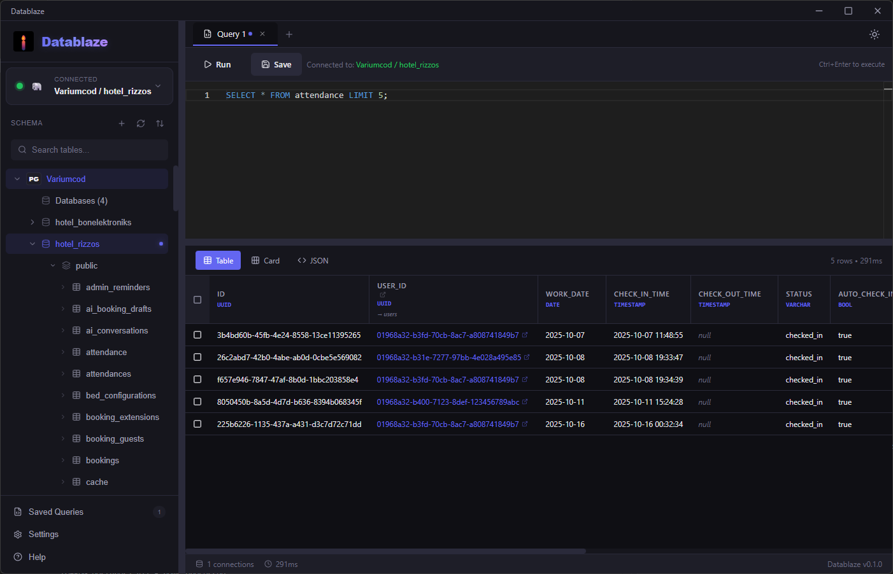
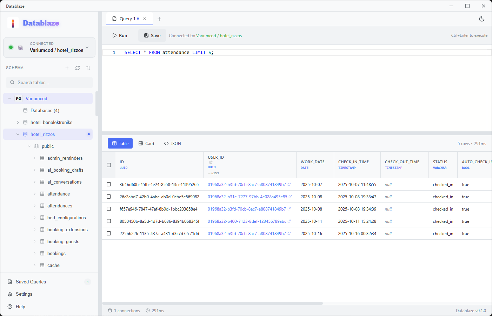

<p align="center">
  
</p>

<h1 align="center">Datablaze</h1>

<p align="center">
  <strong>⚡ A Modern, Lightning-Fast Database Manager</strong>
</p>

<p align="center">
  <a href="#features">Features</a> •
  <a href="#installation">Installation</a> •
  <a href="#usage">Usage</a> •
  <a href="#tech-stack">Tech Stack</a> •
  <a href="#development">Development</a> •
  <a href="#license">License</a>
</p>

<p align="center">
  
  
  
  
  
</p>

---

## ✨ Features

### 🔌 **Multi-Database Support**
- **PostgreSQL** - Full support with schema browsing
- **MySQL** - Complete compatibility with all MySQL features
- **SQLite** - Lightweight file-based database support
- **SQL Server** - Microsoft SQL Server support with native syntax (TOP vs LIMIT)
- Easy connection management with saved credentials
- Automatic SQL syntax adaptation per database engine

### 🎨 **Beautiful Interface**
- Modern, sleek dark and light themes
- Custom frameless window with native controls
- Responsive sidebar with table tree explorer
- Monaco-powered SQL editor with syntax highlighting and auto-completion
- Context menus for quick actions

### ⚡ **Performance First**
- Built with Rust backend for maximum speed
- Streaming query results for large datasets
- Smart result truncation (2000 row limit) to prevent UI freezes
- Lazy loading for Base64 images
- Independent tab execution - each tab maintains its own results

### 🛠️ **Developer Experience**
- **Smart Multi-tab System**
  - Each tab preserves its own query and results
  - Intelligent tab naming based on SQL content (e.g., "SELECT users", "UPDATE bookings")
  - Right-click tab menu: Close tabs to right, Close other tabs, Close all, Force close all
  - Middle-click to close tabs
  - Auto-creates new tabs when exploring tables
- **Advanced Query Editor**
  - SQL syntax highlighting
  - Auto-completion for tables, columns, and SQL keywords
  - Execute with Ctrl+Enter
  - Save frequently used queries
- **Smart Result Views**
  - Table, JSON, and Card view modes
  - Inline cell editing with type-aware inputs (numbers, dates, booleans, text)
  - Copy cells, rows, or entire results as CSV/JSON
  - Foreign key detection and navigation
  - Sort results by any column
- **Table Structure View**
  - View column definitions, data types, and constraints
  - Visual badges for PRIMARY KEY, UNIQUE, FOREIGN KEY, AUTO INCREMENT
  - See default values and nullable status
  - Understand table relationships at a glance

### 🔍 **Smart Features**
- **Foreign Key Navigation**: Click on FK values to explore related data in sidebar
- **Intelligent FK Detection**: Only shows FK links for tables that actually exist
- **Type-aware Editing**: 
  - Number inputs for integers and decimals
  - Date/time pickers for temporal fields
  - Checkboxes for booleans
  - Text inputs for strings
- **Context Menus**: Right-click on tabs, tables, and cells for quick actions
- **Auto-closing menus**: Only one context menu visible at a time

### 🔒 **Security**
- Local-first: your data never leaves your machine
- Optional password storage
- No telemetry or tracking

---

## 📥 Installation

### Pre-built Binaries

Download the latest release for your platform:

| Platform | Download |
|----------|----------|
| Windows  | [📦 Datablaze_0.2.0_x64_en-US.msi](https://github.com/HaroldXd/Datablaze/releases/download/versions/Datablaze_0.2.0_x64_en-US.msi) |
| macOS    | Coming soon |
| Linux    | Coming soon |

### Build from Source

```bash
# Clone the repository
git clone https://github.com/HaroldXd/Datablaze.git
cd datablaze

# Install dependencies
npm install

# Run in development mode
npm run tauri dev

# Build for production
npm run tauri build
```

---

## 🚀 Usage

### Connecting to a Database

1. Click the **connection selector** in the sidebar
2. Click **"Add connection"**
3. Fill in your database details:
   - Database type (PostgreSQL/MySQL/SQLite/SQL Server)
   - For PostgreSQL/MySQL/SQL Server: Host, Port, Username, Password
   - For SQLite: Database file path
   - Database name (optional for PostgreSQL/MySQL/SQL Server - you can browse all databases)
4. Click **Connect**

### Querying Data

- **Double-click a table** to preview its data
- **Write custom SQL** in the query editor
- Press **Ctrl+Enter** or click **Run** to execute
- Results appear in the panel below with row count and execution time

### Keyboard Shortcuts

| Shortcut | Action |
|----------|--------|
| `Ctrl + Enter` | Execute query |
| `Ctrl + S` | Save query |
| `Ctrl + T` | New tab |
| `Ctrl + W` | Close tab |

---

## 🏗️ Tech Stack

| Layer | Technology |
|-------|------------|
| **Frontend** | React 19, TypeScript, Zustand |
| **Editor** | Monaco Editor |
| **Backend** | Rust, Tauri 2.0 |
| **Database Drivers** | SQLx (PostgreSQL, MySQL, SQLite), Tiberius (SQL Server) |
| **Styling** | Custom CSS with CSS Variables |
| **Build** | Vite, Cargo |

---

## 💻 Development

### Prerequisites

- [Node.js](https://nodejs.org/) (v18+)
- [Rust](https://rustup.rs/) (stable)
- [Tauri CLI](https://tauri.app/v2/guides/getting-started/setup/)

### Project Structure

```
datablaze/
├── src/                    # React frontend
│   ├── components/         # UI components
│   ├── stores/            # Zustand state management
│   ├── lib/               # Utilities and Tauri bindings
│   └── App.tsx            # Main application
├── src-tauri/             # Rust backend
│   ├── src/
│   │   ├── database/      # Database drivers (postgres, mysql, sqlite, sqlserver)
│   │   ├── lib.rs         # Tauri commands
│   │   └── models.rs      # Data structures
│   └── Cargo.toml
├── public/                # Static assets
└── package.json
```

### Running Tests

```bash
# Frontend tests
npm run test

# Rust tests
cd src-tauri && cargo test
```

---

## 🎨 Screenshots

<p align="center">
  
  <br>
  <em>Dark theme with query results</em>
</p>

<p align="center">
  
  <br>
  <em>Light theme with table explorer</em>
</p>

---

## 🤝 Contributing

Contributions are welcome! Please feel free to submit a Pull Request.

1. Fork the repository
2. Create your feature branch (`git checkout -b feature/AmazingFeature`)
3. Commit your changes (`git commit -m 'Add some AmazingFeature'`)
4. Push to the branch (`git push origin feature/AmazingFeature`)
5. Open a Pull Request

---

## 📄 License

This project is licensed under the MIT License - see the [LICENSE](LICENSE) file for details.

---

## 🙏 Acknowledgments

- [Tauri](https://tauri.app/) - For the amazing framework
- [SQLx](https://github.com/launchbadge/sqlx) - Async SQL toolkit for Rust
- [Tiberius](https://github.com/prisma/tiberius) - SQL Server driver for Rust
- [Monaco Editor](https://microsoft.github.io/monaco-editor/) - VS Code's editor
- [Lucide Icons](https://lucide.dev/) - Beautiful icons

---

<p align="center">
  Made with ❤️ and ⚡
</p>

<p align="center">
  <a href="https://github.com/HaroldXd/Datablaze">
    
  </a>
</p>
